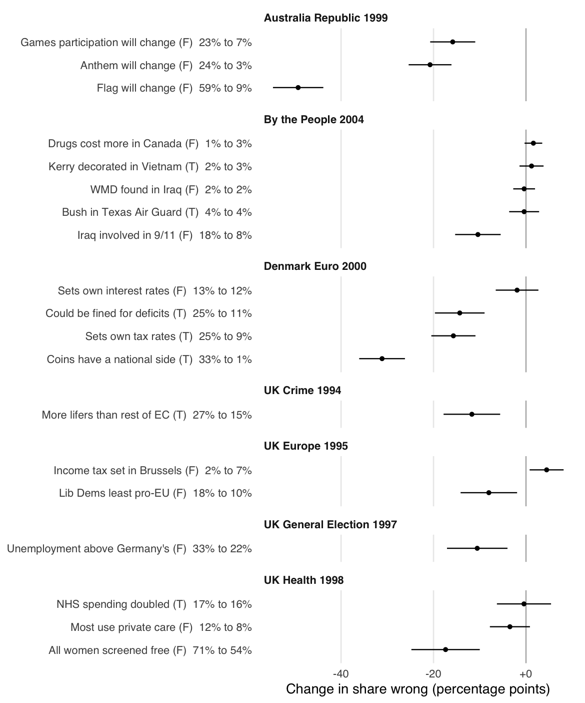

## Deliberation and Misinformation

Robert C. Luskin and Gaurav Sood

Deliberation increases factual knowledge. Does it also dispel misinformation?
We follow answers to 19 misinformation-type items through seven Deliberative
Polls and estimate effects on two such items in Deliberative Polls with control
groups.

<p align="center">
  
</p>

### Repository

| Path | Contents |
|---|---|
| `data/` | Public item-level data and the manifest for the two controlled polls; see [data/README.md](data/README.md) |
| `docs/` | Item wording and keys, exclusions, and how each citation was checked |
| `R/` | Reading the data (`sources.R`), estimates (`analysis.R`), figure style, table output |
| `scripts/` | `run_all.R` writes `tabs/*.csv`; `figures.R` writes `figs/`; `tables.R` writes LaTeX tables and number macros |
| `ms/` | `main.tex`, `references.bib`, and the compiled `main.pdf` |
| `tests/testthat/` | Reproductions of numbers computed from the original files |

### Running it

```
make restore   # install the package versions in renv.lock
make check     # analysis, figures, tables, manuscript, lint, tests
```
