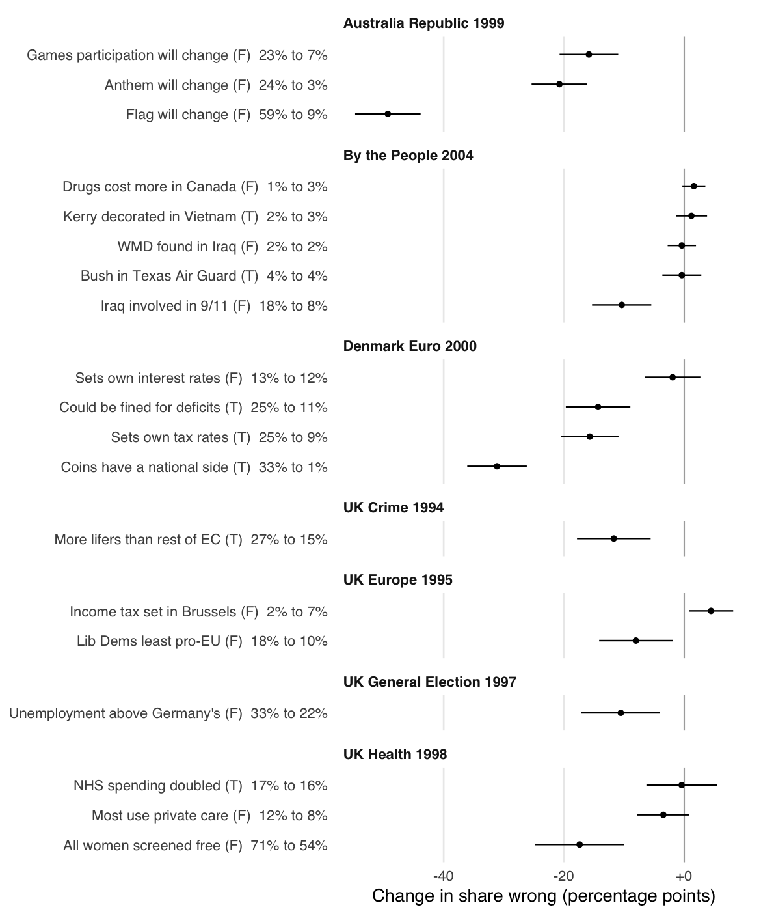

# Deliberation and Misinformation

Robert C. Luskin and Gaurav Sood

[Paper](ms/main.pdf) · [Data](data/README.md)

## Question and motivation

Does deliberation dispel misinformation as well as increase factual knowledge?
A wrong answer may reflect a confidently held false belief, but it may also be
a guess. Following wrong answers and don't-know responses separately helps
show whether people who begin wrong are harder to move than those who admit
ignorance. [The Waters of Casablanca](https://github.com/finite-sample/know_casablanca)
explains this measurement distinction.

## Data and research design

The analysis follows 19 misinformation-type items through seven Deliberative
Polls and examines two items in America in One Room and its climate edition,
which include control groups. The seven-poll analysis describes changes among
participants. The controlled studies compare participants with controls, using
the specifications and uncertainty estimates documented in the paper.

## Key findings

Incorrect answers fall across most of the misinformation-type items. Participants
who begin wrong often finish right, about as often as those who begin with a
don't-know response. The controlled comparisons also show reductions in errors,
although the reduction in confident climate denial is small and is not clearly
sustained a year later. Wrong multiple-choice answers alone do not establish
that respondents held confident false beliefs.



The figure compares incorrect-answer shares before and after deliberation,
item by item, with uncertainty intervals. These within-participant changes
should be read separately from the controlled comparisons reported in the paper.

## Reproduce

```
make restore
make check
```

`make restore` installs the package versions in `renv.lock`. Run `make check`
from the repository root to lint the code, rebuild the analysis and exhibits,
run the tests, and compile the manuscript. `make analysis` rebuilds the data,
estimates, figures, tables, and manuscript number macros without compiling the
paper. `make test` also rebuilds these outputs before testing them.

`scripts/99_run_all.R` loads the configuration and helpers, then executes stages
01–04 in order. Each stage runs in its own environment and passes its results
to the next through files:

| Script | Responsibility |
|---|---|
| `00_config.R` | Project paths, source checksums, item labels, plot theme, colors, figure dimensions, and table formatting defaults |
| `00_utils.R` | Shared CSV readers, answer coding, plotting helpers, and LaTeX writers; loading it creates no outputs |
| `01_prepare_data.R` | Verify source files, fetch the controlled-poll inputs, and write `data/derived/prepared_data.rds` |
| `02_estimate.R` | Read the prepared data and write numerical results to `tabs/*.csv` |
| `03_figures.R` | Read the result tables and write PDF and PNG figures to `figs/` |
| `04_tables.R` | Read the result tables and item metadata, then write LaTeX tables and number macros to `tabs/` |
| `99_run_all.R` | Run the complete pipeline |

Edit `theme_paper()`, `COLORS`, `FIGURE_SIZES`, and `FIGURE_DPI` in
`00_config.R` to change plot presentation. `TABLE_STYLE` controls table font
size, column spacing, row spacing, and the item table's column layout. Captions
and notes stay with the manuscript. `data/derived/` and downloaded source files
in `data/cache/` are ignored by Git and rebuilt as needed.

## Files and pipeline

| Path | Contents |
|---|---|
| `data/` | Public item-level data and the manifest for the two controlled polls; see [data/README.md](data/README.md) |
| `docs/` | Item wording and keys, exclusions, and how each citation was checked |
| `scripts/` | Numbered analysis stages, shared configuration, and helpers; see the execution order below |
| `ms/` | `main.tex`, `references.bib`, and the compiled `main.pdf` |
| `tests/testthat/` | Reproductions of numbers computed from the original files |
